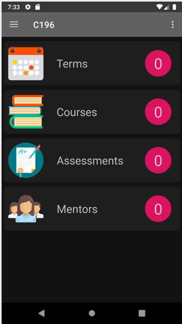
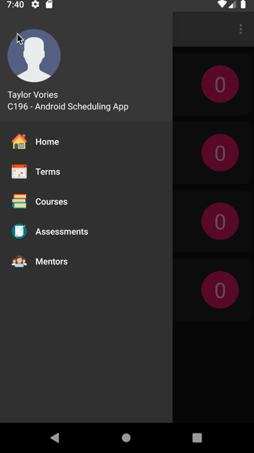
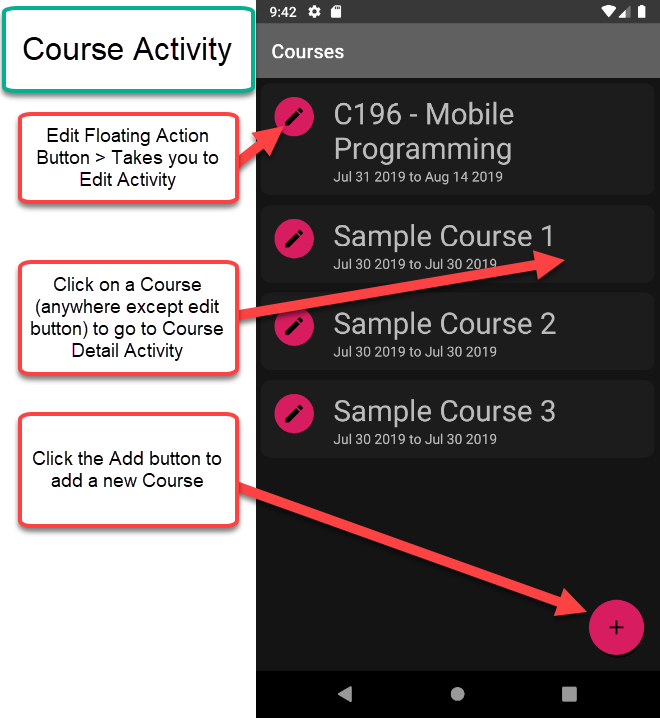
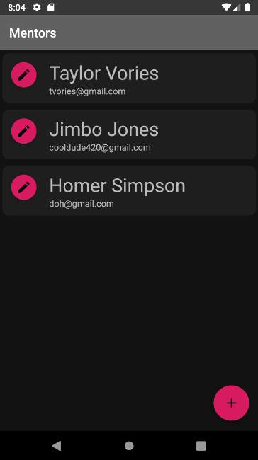

# WGU Mobile Application Developmenet - C196

## Overview
This Android application is a basic student scheduler as defined by the requirements of C196.  It allows a student to:

- Track Terms
- Track Courses in a given Term
- Track Assessments in a given Course
- Track Mentors and their contact information and associate them with a Course

## Android Version and Hardware
This project was designed to be used with Android API 28 (Pie).  This project was tested on a Pixel XL (Physical and Emulator).  See the list of Libraries used for additional versioning information.

## Libraries Used
As of submission, here is the list of libraries used in the gradle file:

```gradle
dependencies {
    implementation 'androidx.room:room-runtime:2.1.0'
    annotationProcessor 'androidx.room:room-compiler:2.1.0'
    implementation fileTree(include: ['*.jar'], dir: 'libs')
    implementation 'androidx.appcompat:appcompat:1.1.0-rc01'
    implementation 'androidx.constraintlayout:constraintlayout:1.1.3'
    implementation 'com.google.android.material:material:1.1.0-alpha07'
    testImplementation 'junit:junit:4.12'
    androidTestImplementation 'androidx.test:runner:1.3.0-alpha01'
    androidTestImplementation 'androidx.test.espresso:espresso-core:3.3.0-alpha01'
    implementation 'com.jakewharton:butterknife:10.1.0'
    annotationProcessor 'com.jakewharton:butterknife-compiler:10.1.0'
    implementation 'androidx.lifecycle:lifecycle-extensions:2.0.0'
    implementation 'androidx.recyclerview:recyclerview:1.1.0-beta01'
    implementation 'com.android.support:design:28.0.0'
    implementation 'com.android.support:appcompat-v7:28.0.0'
    implementation 'com.android.support:support-v4:28.0.0'
    implementation 'com.android.support.constraint:constraint-layout:1.1.3'
}
```

## How to build
Open this project in Android Studio and build.  As long as the gradle file is there, everything should build successfully.

## The app
The app consists of 1 primary activity and 4 sub activities.

#### The Main Activity


The main screen provides navigation to all of the sub-activities.  

It also features a drawer navigation that is not fully functional.  It started as an experiment but ended up requiring too much reworking to fully implement.  I wanted to leave it in because it looks nice and it was something I would like to include in future projects.



The app features a menu bar that allows the user to load sample data or delete the database data and start over.


### Term Activity

The Term activity allows the user to view their terms.  They can go to a detailed view of their term or edit the term by clicking the edit Floating Action Button.  They can also create a new term by hitting the + button.


### Courses Activity

The Courses activity allows the user to view their courses.  They can view details, edit the course, or add a new course.



### Assessment Activity

The Assessment activity allows the user to view their assessments and their due dates.  They can add or edit these assessments.


### Mentor Activity

The mentor activity provides a location for the user to view their course mentors and their contact information.  Mentors can be assigned to a course in the course details page.

